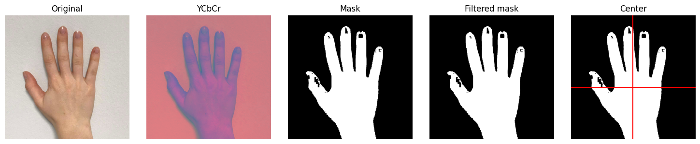

# Skin Tone Detector
A simple script that locates the center of an area with skintone like colors.  
The output of this script serves as a reference for implementing the same procedure on an FPGA-based system.

## Processing Steps
- Read the given image  
- Convert the image to the YCbCr color space  
- Create a binary mask using threshold values for the Cr and Cb channels  
- Apply median blur to filter the mask  
- Determine the centroid using geometric moments

